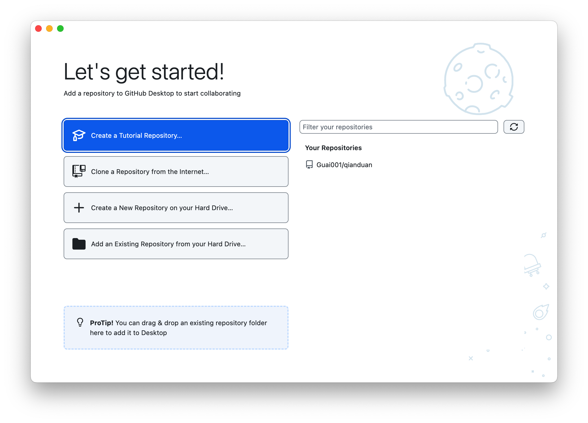
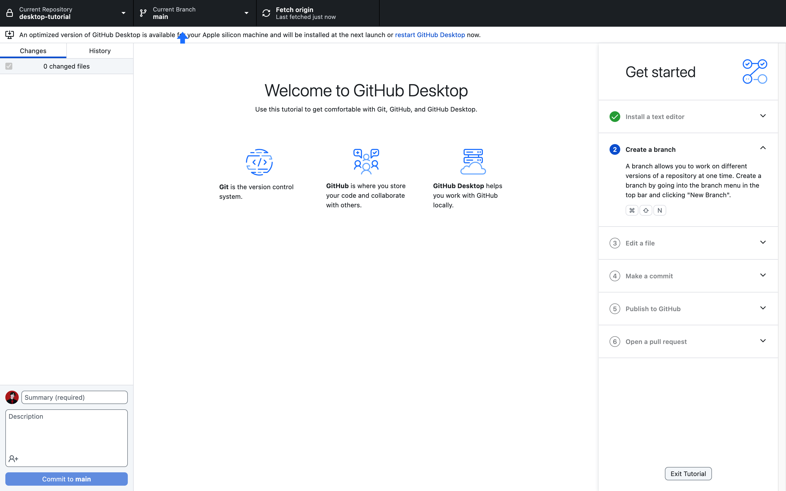
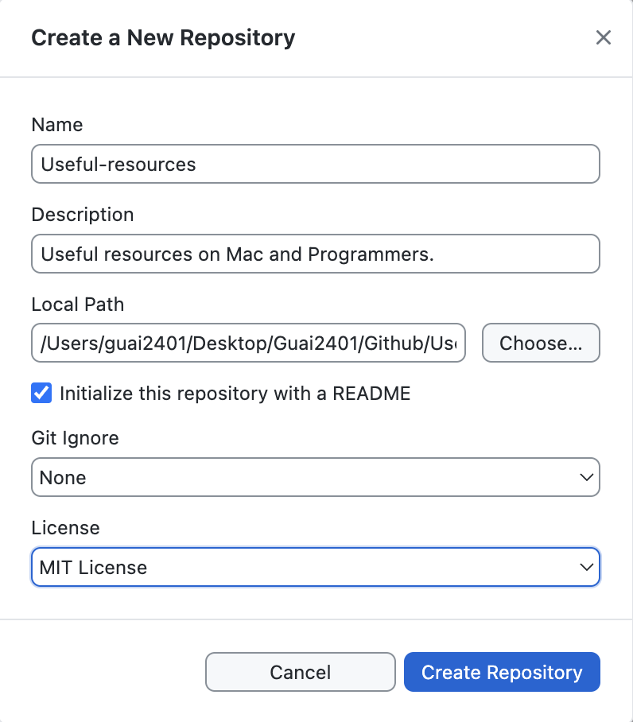
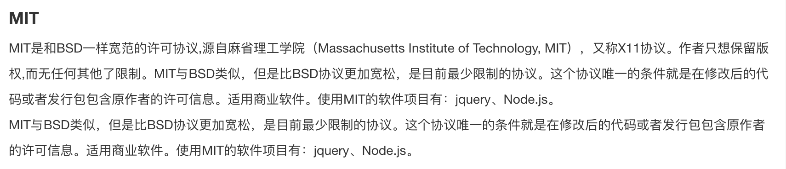
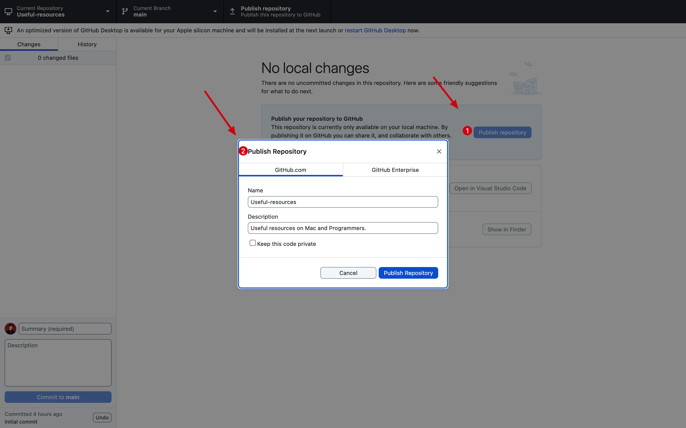
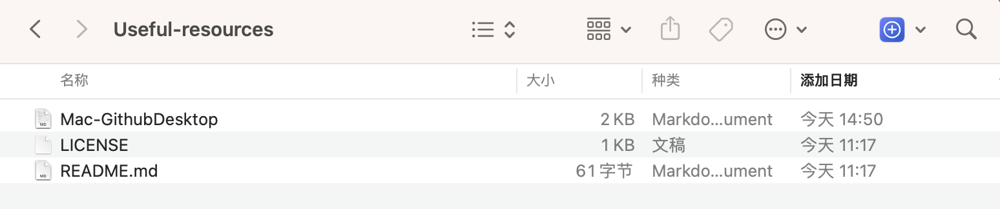
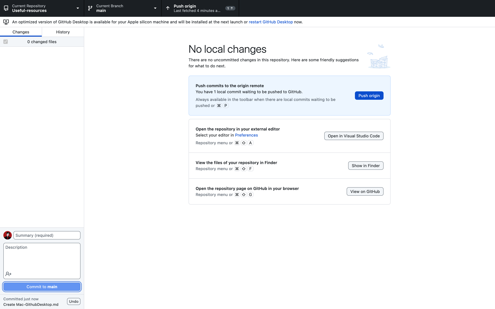
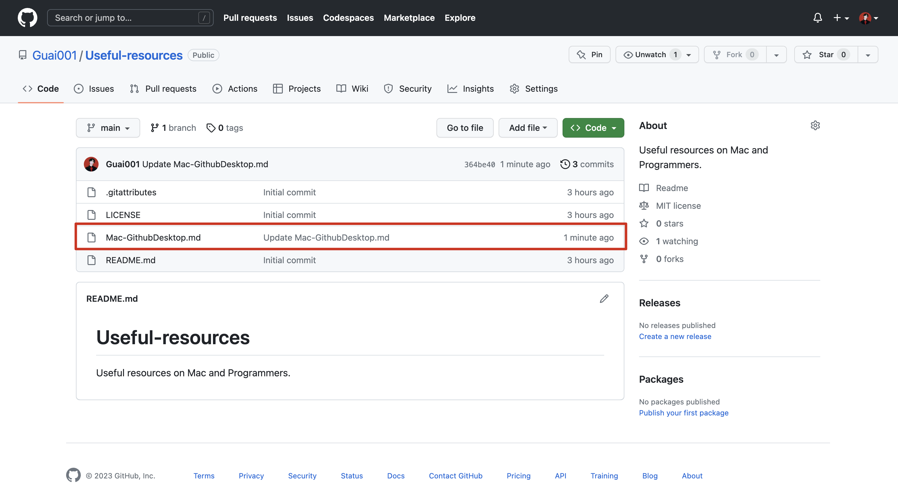
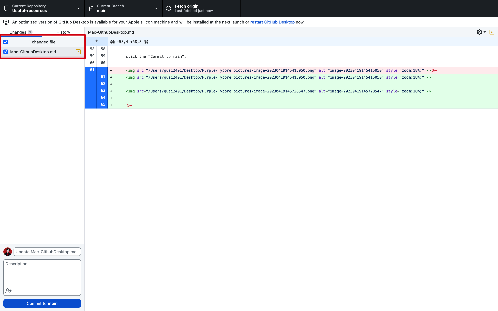
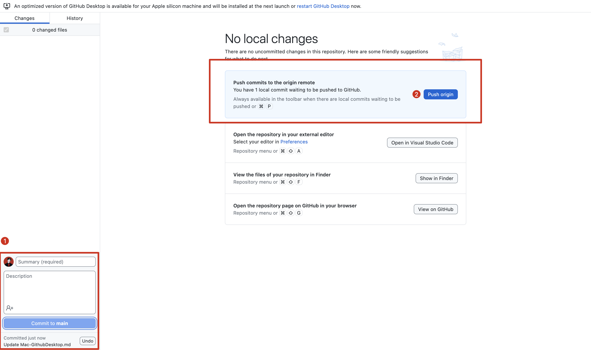

# 🌻Mac GithubDesktop

> Use GithubDesktop to upload files to your Github Desktop.

## Github Desktop

1. Download and log in

   

   The redirected page is shown below:

   

   

   then it will let you to move the Github Desktop to the application

   

   2. Use the Github Desktop

      

      > 💫A Tutorial Repository in Github like a project.

      

      

      

      Create a new Repositorytory:

      

      > - Git Ignore: Stores files that ignore rules uploaded to git.
      >
      >   [🔗Click me to go to the webset that describes the Git Ignore.](https://github.com/onlynight/ReadmeDemo/tree/master/Readmes/GitIgnore)
      >
      > - License: Open source protocol
      >
      >   🔗[Click me to go to the webset that describes the protocol.](https://www.runoob.com/w3cnote/open-source-license.html)
      >
      >   > MIt is advised
      >
      >   

      Publish repository:

      

      view the files in the directory:

      

      Mac-GithubDesktop is the new file I added.

      

      click the "Commit to main".

      

      

      The result of my change：

      

      > Click the "Commit to main", Submit your changes.

      

      >  Then, click the "Push origin", Update your modified file to Github.

